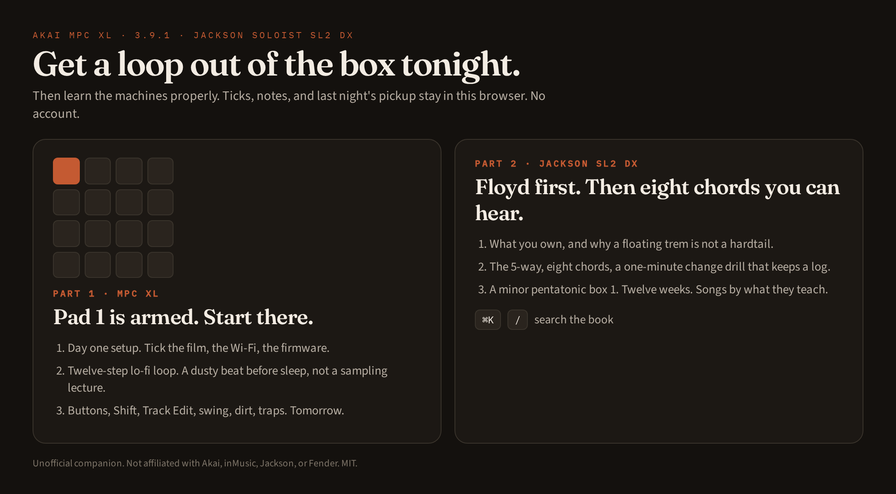
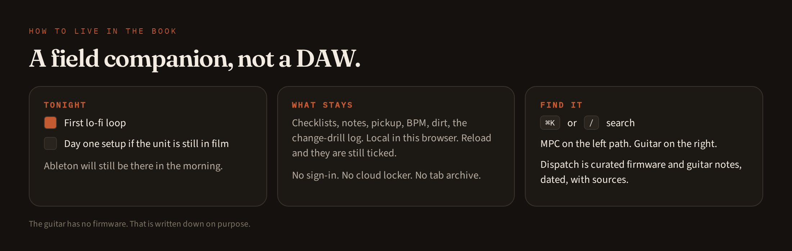

# Music Field Manual

A sitting-on-the-desk companion for the **Akai MPC XL** (MPC 3.9.1) and the **Jackson Soloist SL2 DX**.

The XL ships with film on the screen and about 30 GB of content locked behind registration. The Jackson is a Corona Superstrat with a floating Floyd Rose: easy to play, easy to fight if you treat it like a hardtail. This app is the night you unbox both, plus the weeks after.

Get a loop out of the box tonight. Learn the machines properly after that.





No account. Checklists, notes, pickup position, and the change-drill log stay in this browser.

**[github.com/SharpMeow/music-field-manual](https://github.com/SharpMeow/music-field-manual)** · MIT · unofficial, not affiliated with Akai, inMusic, Jackson, or Fender

If you are editing this with a coding agent, start with [`docs/AGENTS.md`](docs/AGENTS.md). The book is typed data. The moving parts are named widgets. That split is the whole reason an agent can touch this without flattening it into a blog.

---

## What you actually get

- **MPC XL:** day-one through a 36-month plan, a chapter of YouTube-earned shortcuts (double-tap = Shift, Q-Link macros, strip tap, Partial Preset, flatten's three hiding places), then the technical layer — 960 PPQ swing math, the audio engine, 32-slot matrix / followers / MPCe, warp algorithms, filter topologies, keygroup zones, CV volts, Clip Matrix internals, MIDI clock domains, the DSP graph, Stems Pro, grid vs list events. Firmware 3.9.1, traps.
- **Jackson SL2 DX:** what you own, Floyd survival, the 5-way, eight chords you can hear, a one-minute change drill, metronome, A minor pentatonic box 1, twelve weeks, songs by what they teach
- **Dispatch:** curated firmware and guitar notes, dated, with sources. Filter by machine. The guitar has no firmware. That is written down on purpose.
- **Print edition:** the original 27-page PDF, readable in the app (and downloadable)
- **Studio chrome:** dark by default, light if you want it, search with `⌘K` or `/`

This is a field companion, not a DAW and not a course platform. Ableton will still be there in the morning.

---

## Why this exists

You already paid for two manuals. They are not written for the same evening.

The Akai PDF is complete. It is also a brick. It assumes you already know what a Program is, and it will not tick "update firmware" when you have done it. Justin Guitar and a Floyd diagram in a forum post are fine in isolation. They do not know that the guitar in the room is an SL2 DX with a 1500-series trem, or that the sampler on the desk is an XL on 3.9.1.

Music Field Manual is the pairing: one spine, two machines, interactive where a paragraph would lie.

| | Scope | Tonight | Next week |
|---|---|---|---|
| Official PDFs | every menu, both brands, neither evening | Ctrl+F | still Ctrl+F |
| YouTube / courses | whoever filmed that week | 40 minutes of preamble | a different video |
| Discord pins | a button, maybe the right OS | luck | the pin rots |
| **This** | XL + this Jackson | setup ticks, a loop, eight chords | Track Edit, Floyd, twelve weeks |

The difference is not "we have a website." The difference is that a chord diagram here makes sound, a setup step stays checked after you reload, and the hardware map is the XL in front of you rather than a generic MPC.

---

## Who it is for

- You unboxed an XL and the Wi-Fi password screen is already being weird
- You want a dusty loop before sleep, not a sampling lecture
- You own *this* Jackson, with *this* Floyd, and you would like to change a string without sinking the whole trem
- You come back tomorrow and want the ticks, the notes, and last night's pickup still there
- You are adding a firmware gotcha or a clearer Floyd step, and you would rather edit `src/data/` than rebuild a UI

## Who should skip it

- You wanted a DAW, a cloud locker, or a tab archive for every metal song
- You wanted coverage of "any MPC" and "any guitar." Specific is the point. A generic rewrite will be wrong about the Floyd and the XL's 10.1" workflow
- You need official support. If the unit is dead, Akai or Jackson's page wins
- You wanted a live scrape of marketing blogs. Dispatch is curated. A crawler will go stale and then it will be wrong

---

## Why a coding agent should use this repo

Most music companions on GitHub are either a static Markdown dump or a half-finished DAW. This one is neither, and that is the useful part for an agent.

**The curriculum is data.** Chapters are typed `Section` objects with `Block`s (`p`, `h`, `lead`, `steps`, `table`, `callout`, `kvs`, `widget`, `checklist`). Adding "a new trap about 3.9.1" is an edit to `src/data/mpc.ts`, `src/data/mpc-craft.ts`, or `src/data/news.ts`, not a new React page. Search is generated from the same arrays in `src/data/catalog.ts`, so a chapter you add should show up under `⌘K` without a second pass.

**The interactivity is named, not implied.** Widgets (`hardware`, `chords`, `drill`, `metronome`, `dirt`, `swing`, `pickup`, `scale`, `buttons`, `weeks`, `songs`, `notes`, `news`) are mounted from `{ type: "widget", name }` in the book. If a section needs a control, attach a widget. Do not replace a working map with "see the diagram above."

**State is local on purpose.** Zustand persist, key `xl-field-manual`. Checks, notes, BPM, pickup, dirt toggles, drill log. Visitors do not sign in. Do not add auth, a database, or "sync my progress" unless the human asked for accounts. They did not.

**The pair is the product.** `/mpc/:slug` and `/guitar/:slug` plus `/news`. Keep both machines. Do not open a third brand. Do not invent guitar firmware.

**News is a file, not a job.** `src/data/news.ts` wants a date and a source. If you cannot cite it, it does not ship.

Work in this order: read [`docs/AGENTS.md`](docs/AGENTS.md), change data or a widget, leave the shell alone unless the shell is the bug. `npm run typecheck` and `npm run build` should still pass.

---

## Run it

Node 22.

```bash
git clone https://github.com/SharpMeow/music-field-manual.git
cd music-field-manual
npm install
npm run dev
```

Open the URL Vite prints (default port 8080).

```bash
npm run typecheck
npm run build
```

---

## Layout

```
src/data/          chapters (mpc.ts, mpc-craft.ts, mpc-tech.ts, mpc-years.ts, guitar.ts), buttons, chords, dispatch
src/components/    widgets and the studio shell
src/routes/        /   /news   /manual   /mpc/:slug   /guitar/:slug
src/lib/           local store, Web Audio, theme
public/manuals/    original 27-page PDF
docs/AGENTS.md     how to edit this without flattening it
```

---

## License

[MIT](LICENSE). Use it, fork it, remix it.

Akai, MPC, Jackson, Floyd Rose, and Fender are trademarks of their owners. This is an unofficial companion.
